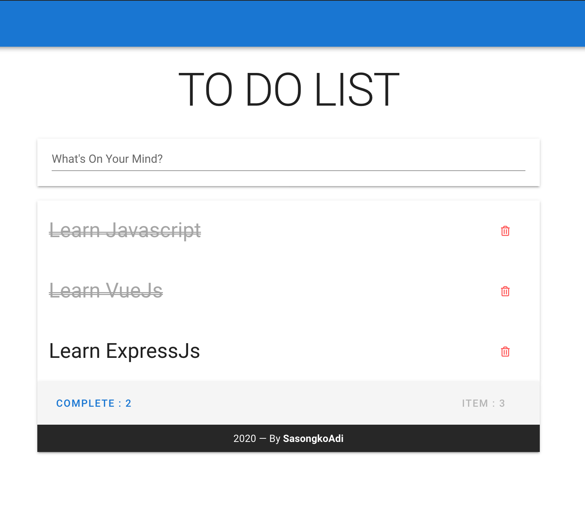

# TO DO LIST


Simple TODO list using:

- [express](https://github.com/sasongkoadi/task-manager#to-do-list-backend) - Nodejs Framework
- [Vue](https://vuejs.org/) - I Love It
- [Vuex](https://vuex.vuejs.org/) - Made state management so fun
- [Vuetify](https://vuetifyjs.com/) -  Made styling so awesome

## Setup Server
Setup Server Mockup and Running [TO-DO-List Backend](https://github.com/sasongkoadi/task-manager#to-do-list-backend)
Follow that instruction

## Project setup
```
npm install
```

### Compiles and hot-reloads for development
```
npm run serve
```

### Compiles and minifies for production
```
npm run build
```

### Lints and fixes files
```
npm run lint
```


### Customize configuration
See [Configuration Reference](https://cli.vuejs.org/config/).
